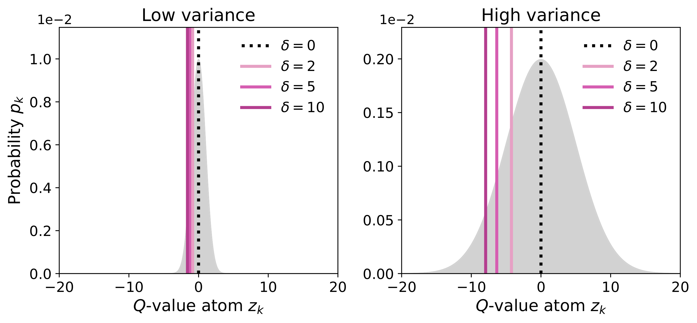

# VAN-Flow: Variance-Averse $n$-Step Offline RL for Sparse Long-Horizon Environments

[](https://9hyeon1225.github.io/van/)
[](https://9hyeon1225.github.io/van/)
[](LICENSE)

Official implementation of **VAN-Flow**, from the NeurIPS 2026 paper
*Variance-Averse $n$-Step Offline Reinforcement Learning for Sparse Long-Horizon Environments*.

🌐 **Project page:** https://9hyeon1225.github.io/van/

---

## Overview

$n$-step returns shorten the effective horizon and reduce bootstrapping bias, but they also amplify **return variance**. On heterogeneous or noisy offline datasets this makes naive $n$-step learning unreliable.

VAN-Flow keeps the benefits of $n$-step returns while controlling their variance:

- **Distributional $n$-step critic.** A categorical (C51-style) critic models the full $n$-step return distribution, so return variance is explicit.
- **Variance-averse expectation.** A CDF-based reweighting of the return distribution assigns lower values to more dispersed returns, with a guarantee under the convex order. $\delta$ controls the strength of aversion ($\delta = 0$ recovers the standard expectation).
- **Flow-matching actor.** An expressive flow policy is trained with variance-averse $Q$-guidance.
- **Rejection sampling.** Best-of-$N$ action selection under the variance-averse value avoids high-variance, out-of-distribution actions.

<p align="center">
  
  <br>
  <em>The variance-averse expectation moves further below the mean as the return distribution becomes more dispersed and as δ grows.</em>
</p>

VAN-Flow is evaluated on long-horizon **OGBench** and **D4RL AntMaze** tasks, against baselines including IQL, ReBRAC, HIQL, LEQ, QC, TD3BC+MS, FQL, BFN and D4PG, in both offline and offline-to-online settings. See the paper and the [project page](https://9hyeon1225.github.io/van/) for full results.

---

## Installation

Python 3.10 or later is required. `requirements.txt` installs the CUDA 12 build of JAX.

```bash
git clone https://github.com/9hyeon1225/van.git
cd van
pip install -r requirements.txt
```

OGBench datasets are downloaded automatically on first use (use `--ogbench_dataset_dir` to change where they are stored). Training logs to [Weights & Biases](https://wandb.ai), so run `wandb login` before the first run.

---

## Usage

All runs use `main.py`; the agent config is `agents/van.py`.

```bash
MUJOCO_GL=egl python main.py \
  --env_name=<ENV_NAME> \
  --horizon_length=<n> \
  --agent.lmbda=<λ> \
  --seed=0
```

### Task-specific hyperparameters

Values not listed for a task use the defaults in `agents/van.py` (`discount=0.995`, `v_min=-200`, `delta=2`).

| Task | `--horizon_length` | `--agent.lmbda` | `--agent.discount` | `--agent.v_min` | `--agent.delta` |
|---|:-:|:-:|:-:|:-:|:-:|
| `humanoidmaze-giant-navigate` | 4 | 10 | 0.999 | -1000 | 2 |
| `humanoidmaze-large-navigate` | 4 | 10 | 0.999 | -1000 | 2 |
| `antmaze-giant-navigate` | 8 | 10 | 0.999 | -1000 | 2 |
| `antmaze-large-navigate` | 4 | 3 | 0.995 | -200 | 2 |
| `antmaze-large-explore` | 3 | 3 | 0.995 | -200 | 2 |
| `antmaze-teleport-navigate` | 2 | 300 | 0.999 | -1000 | 7 |
| `scene-play` | 3 | 3 | 0.995 | -200 | 2 |
| `puzzle-3x3-play` | 5 | 3 | 0.995 | -200 | 2 |
| `puzzle-3x3-noisy` | 5 | 3 | 0.995 | -200 | 2 |

<details>
<summary><b>Full commands for each task</b></summary>

```bash
# humanoidmaze-giant-navigate
MUJOCO_GL=egl python main.py \
  --env_name=humanoidmaze-giant-navigate-singletask-v0 \
  --horizon_length=4 \
  --agent.lmbda=10 \
  --agent.discount=0.999 \
  --agent.v_min=-1000

# humanoidmaze-large-navigate
MUJOCO_GL=egl python main.py \
  --env_name=humanoidmaze-large-navigate-singletask-v0 \
  --horizon_length=4 \
  --agent.lmbda=10 \
  --agent.discount=0.999 \
  --agent.v_min=-1000

# antmaze-giant-navigate
MUJOCO_GL=egl python main.py \
  --env_name=antmaze-giant-navigate-singletask-v0 \
  --horizon_length=8 \
  --agent.lmbda=10 \
  --agent.discount=0.999 \
  --agent.v_min=-1000

# antmaze-large-navigate
MUJOCO_GL=egl python main.py \
  --env_name=antmaze-large-navigate-singletask-v0 \
  --horizon_length=4 \
  --agent.lmbda=3

# antmaze-large-explore
MUJOCO_GL=egl python main.py \
  --env_name=antmaze-large-explore-singletask-v0 \
  --horizon_length=3 \
  --agent.lmbda=3

# antmaze-teleport-navigate
MUJOCO_GL=egl python main.py \
  --env_name=antmaze-teleport-navigate-singletask-v0 \
  --horizon_length=2 \
  --agent.lmbda=300 \
  --agent.discount=0.999 \
  --agent.v_min=-1000 \
  --agent.delta=7

# scene-play
MUJOCO_GL=egl python main.py \
  --env_name=scene-play-singletask-v0 \
  --horizon_length=3 \
  --agent.lmbda=3

# puzzle-3x3-play
MUJOCO_GL=egl python main.py \
  --env_name=puzzle-3x3-play-singletask-v0 \
  --horizon_length=5 \
  --agent.lmbda=3

# puzzle-3x3-noisy
MUJOCO_GL=egl python main.py \
  --env_name=puzzle-3x3-noisy-singletask-v0 \
  --horizon_length=5 \
  --agent.lmbda=3
```

</details>

### Notes

- **Tasks.** `...-singletask-v0` runs OGBench's default task. To run a specific task, use `...-singletask-task{1..5}-v0`, e.g. `antmaze-large-navigate-singletask-task3-v0`.
- **Offline-to-online.** By default, each run trains offline for 1M steps (`--offline_steps`) and then fine-tunes online for 1M steps (`--online_steps`). Set `--online_steps=0` for offline training only.
- **Seeds.** Change `--seed` to run different seeds.
- **D4RL AntMaze.** D4RL AntMaze tasks (e.g. `antmaze-large-diverse-v2`) are also supported but need [D4RL](https://github.com/Farama-Foundation/D4RL), which is not in `requirements.txt`.

---

## Acknowledgements

This codebase builds on [QC (Reinforcement Learning with Action Chunking)](https://github.com/ColinQiyangLi/qc) and [FQL (Flow Q-Learning)](https://github.com/seohongpark/fql). We thank the authors for releasing their code.

---

## Citation

If you find this work useful, please cite:

```bibtex
@inproceedings{kang2026vanflow,
  title     = {Variance-Averse $n$-Step Offline Reinforcement Learning for Sparse Long-Horizon Environments},
  author    = {Kang, Guhyeon and Kwon, Minhae},
  booktitle = {Advances in Neural Information Processing Systems (NeurIPS)},
  year      = {2026}
}
```
